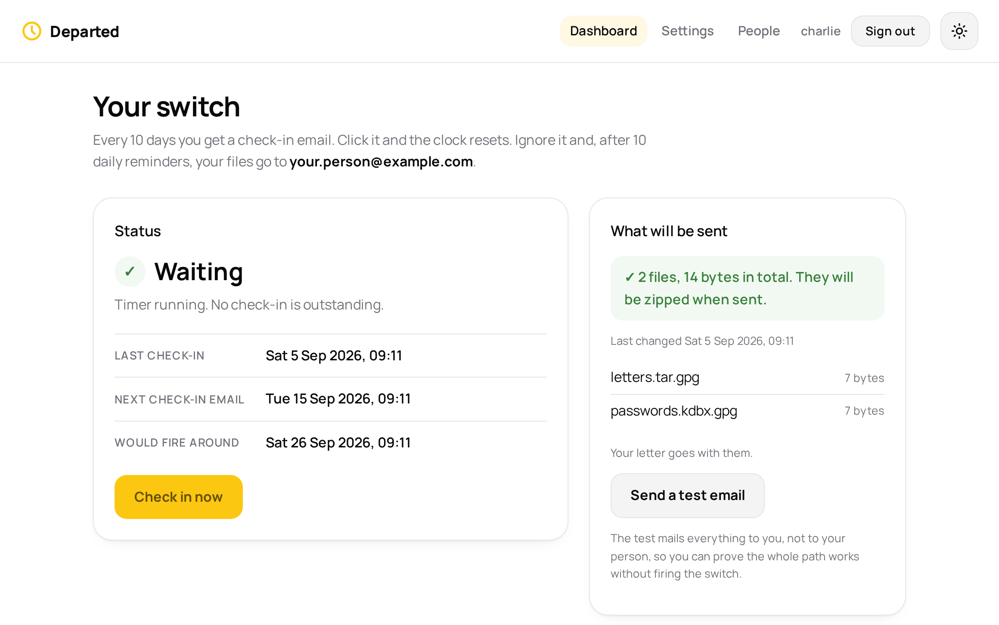

# Departed

> **Beta.** Departed is new, and nobody has run it for long. Try it, read the code, and tell me what breaks. Do not trust it yet with something that matters. Test the whole path with the **Send a test email** button before you rely on any of it.

A dead man's switch. A small self-hosted service that emails an archive you locked yourself to one trusted person if you stop responding to check-in emails.

- Every 10 days it emails you a check-in link. Click it and the clock resets.
- Ignore it and it sends the same link once a day for 10 more days.
- Still nothing, and it emails your files to the person you chose, about 21 days after your last check-in. Once. Then it stops.

Those are the timings it arrives with. You set all three yourself on the settings page: how long it waits before it asks, how many times it asks again, and how long it leaves between each asking.

The files are locked before the app ever has them. You can do that with your own tool, or let the settings page do it: the locking happens in your own browser, the passphrase is made there and shown to you once, and only the sealed result reaches the server. Either way the app never has the passphrase, never encrypts and never decrypts. A stolen server or a read email yields only an encrypted blob.

Several people can share one copy. Each has their own account, their own settings, their own files and their own timer, and nobody can see anybody else's.

<picture>
  <source srcset="docs/images/app-dark.png" media="(prefers-color-scheme: dark)">
  
</picture>

## Run it

You need Docker. There are no settings in the compose file: everything is set in the browser afterwards.

```bash
sudo mkdir -p /opt/departed
sudo chown -R 1000:1000 /opt/departed
docker compose up -d
```

Open `http://<your-server>:4160`. The first visit asks you to make an account, and that first account is the administrator. Then fill in the settings page, add your files, and press **Send a test email**. You get exactly what your person would get, so you can prove the whole path works without firing anything.

The app runs as user 1000 inside the container, which is why the folder is owned by 1000 on the host.

### The only two things on the server

There is no `.env` file and nothing to fill in. The compose file is the whole of it, and it holds two facts:

- `4160:8080` is the port you open in a browser. Change the `4160` if something else is using it.
- `/opt/departed:/data` is the folder on the server holding the database, your files and the log. Back that folder up and you have everything.

Two optional environment lines exist if you ever want them. `MAX_UPLOAD_MB` (default 64) caps a single upload, and `SECRET_KEY` is used to encrypt stored secrets instead of the key file the app makes for itself.

### Everything else is on the settings page

Signed in, you set:

- Your email address, and your person's.
- Your mail server, port, encryption, username, password and from-address. The password is stored encrypted and never shown again.
- **The timing**, all three parts of it: days between a check-in and the next asking, how many times it asks again, and the days between those. Nothing about the schedule is fixed in the code. The page adds your numbers up and tells you in words when your files would go. Fractions are allowed, so `0.01` is about a quarter of an hour, which is handy for testing.
- The web address you open it at. Your check-in links are built from this, so it has to work from wherever you read your email.
- Your timezone.
- **Your files.** Either let the page seal them in your browser, or upload something you encrypted yourself. Sealed or not, the app only ever attaches what it was given.
- **Your letter.** A few words that go in the body of the email carrying your files. It is stored encrypted at rest but the app can read it, unlike your files, so keep anything private inside the locked files instead.
- Your own sign-in password.

### Sealing files in your browser

Choose your files on the settings page and press **Seal and save**. What happens next happens entirely in your browser:

1. The files are zipped locally.
2. A passphrase is generated with your browser's own random number source, or you type one of your own.
3. The zip is encrypted with AES-256-CBC, using a key stretched from the passphrase with 600,000 rounds of PBKDF2-SHA256.
4. Only the sealed result is uploaded. The passphrase is never sent, never stored and never logged.

You are shown the passphrase once. Write it down. Nothing can tell you what it was afterwards, not this program and not anybody running it.

To change what is inside, press **Change what is inside** and give the passphrase. The browser fetches the sealed file, opens it locally, lets you add and remove things, and seals it again. **Check I can still open it** does the same without changing anything, which is worth doing occasionally.

**The honest caveat.** The page doing this work is served by your own server. If somebody took over that server they could change the page to steal the passphrase as you typed it. That is true of every web page that does encryption. If you want no such doubt, encrypt the files with your own tool on your own machine and upload the result instead. Both routes are supported, and the second one is why the first is optional.

### What the recipient gets

One file, called **Open me**. They save it, double-click it, and it opens in whatever browser their computer already has and asks for the passphrase. Then their files are listed with a button to save each one, or all of them.

Nothing to install. It works on Windows, on a Mac and on Linux, and it works with no internet connection: the file carries both the encrypted archive and the code that opens it, and it never reaches out to anything. There is a test that fails if that file ever gains a single external address.

It is a web page only on the outside. Inside it is an ordinary OpenSSL container holding an ordinary zip, and the page has a button to save that out. Anyone who would rather not trust a web page can use one command instead:

```bash
openssl enc -d -aes-256-cbc -pbkdf2 -iter 600000 -md sha256 -in sealed.enc -out inside.zip
```

The email that carries the archive explains the double-click, and the file itself explains the command. There is also a page at `/open`, and the same page on the website, which takes either kind of file.

### Accounts

The first visit makes the first account, and it is the administrator. Administrators get a **People** page to add and remove others, and can hand out administrator rights.

Removing somebody deletes their settings, their timer, their log and their files. There is no undo. The last administrator cannot be removed, and nobody can remove their own account.

Sign-ins last 30 days on a browser. Changing a password ends that person's other sign-ins. Repeated wrong passwords are slowed down and every attempt is logged.

The check-in links emailed to you deliberately do **not** ask for a password. They carry their own long single-use token and have to work with one tap from a phone.

### Things it is careful about

- **The link is single-use.** A fresh token is issued for each check-in cycle and cleared when used. An old email cannot reset the timer. The token is stored hashed.
- **Firing that fails is retried** every five minutes, for ever, logged as an error each time. It is never marked sent until the mail server accepts it.
- **It will not send an empty envelope.** With no files, it does not fire. It emails you an alert once a day instead, and fires as soon as files appear.
- **State survives restarts.** Everything is in `departed.db` on the mounted volume.
- **A long outage does not cause an instant firing.** Timing runs from when emails were actually sent, so the check-in and all the reminders go out first.
- **If it fires by mistake** you get an email. Change the passphrase, then press **Check in now** to arm it again.
- Logs go to the container output and to `departed.log` in the data folder.

### What is stored, and how

Everything lives in the one folder you mounted:

| | |
|---|---|
| `departed.db` | accounts, settings, timers and the log |
| `archives/<id>/` | each person's files, exactly as they were uploaded |
| `secret.key` | encrypts the mail passwords and letters in the database |
| `session.key` | signs the sign-in cookies |
| `departed.log` | the log |

Both key files are made on first run and are readable only by the app's own user. Encrypting the mail password and the letter protects a copy of the database on its own, a backup or a screenshot. It does not protect against somebody who has taken the whole folder, because the key is in it. Your archive is different: that is locked with a passphrase this program never has.

### Updating

```bash
docker compose pull
docker compose up -d
```

## Access

Departed has no business being on the open internet. Keep it on your own network, and reach it from outside through whatever private connection you already use for that. Setting that up is your business, not this app's.

Whatever address it gives you, put it in the web address setting. That is what the links in your check-in emails are built from, so it has to work from wherever you read your email.

The sign-in password is a second lock, not the first one. Do not treat it as a reason to expose the app.

## Licence

GPL-3.0. See `LICENSE`.
